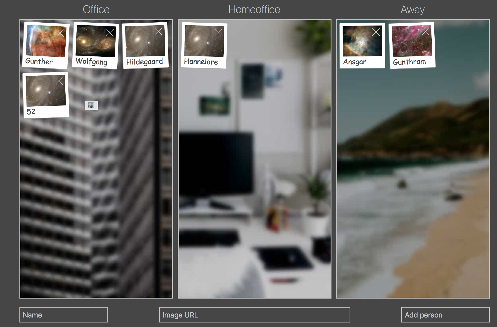

# Awayboard

"The Awayboard" is a dashboard like overview for teams, whose members work part-time remotely, 
to know which team member is working from where.

Draggable photo-like tiles of team-members can be placed in columns
for office, homeoffice and away.

## Usage
Enter a name and an image-url (has to be somewhere online), click "Add person".
Then drag your tile to the desired column.

After that, tiles are stored permanently, so every person may update their working status accordingly.

## Installation
* npm 
* ?
* ? 
* profit
