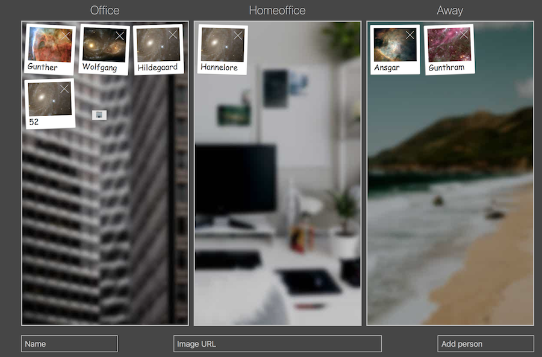

# Awayboard

The "Awayboard" is a dashboard-like overview for teams, whose members may work remotely, 
to know which team member is working from where.

Draggable photo-like tiles of the team-members can be placed in columns
for office, homeoffice and away.
(the default columns, see also: [Configuration](#configuration))



## Table of contents
  * [Table of contents](##table-of-contents)
  * [Installation](#installation)
  * [Configuration](#configuration)
  * [Usage](#usage)
  * [Usage via API](#usage-via-api)
    + [Request all people](#request-all-people)
    + [Add new /update existing person](#add-new--update-existing-person)
    + [Delete an existing person](#delete-an-existing-person)
  * [Browser support](#browser-support)
  * [Development](#development)
    + [Installation](#installation-1)
    + [Tests](#tests)
      - [Run the tests](#run-the-tests)
  * [Credits](#credits)
      - [Background images](#background-images)


## Installation
1. Build a docker image

    `$ docker build . -t awayboard `
    
2. Run it with published port.

    `$ docker run -p 5711:5711 awayboard`

Note: `-p` parameters: the first port number is the one on the local machine, the second one the internal one of the docker. 
The later can be changed in the Dockerfile.

## Configuration
In `conf.json` it is possible to configure the desired columns. Each one needs a title, a background-image and a symbol.
The symbol will be  shown in mobile views, instead of the title.

Although the Awayboard uses CSS Grids' `auto-fit` and a fractional width, a configuration with a lot of columns might not look usable.
Up to six columns were tested and look quite ok on a usual large screen.


## Usage
Enter a name in and an image-url (has to be somewhere online) in the fields below, then click "Add person".
A [placeholder image](https://spaceholder.cc) will be provided if no image-url was given.
Then drag your tile to the desired column.

After that, tiles are stored permanently. Later, every person may update their working status as they wish.


## Usage via API
An API with endpoints for reading, creating/updating and removing persons to/from the Awayboard is provided. 
By that, interaction via command-line or other tools is possible. Imagine an NFC-based "check-in-system" to the office or other cool applications 🕹.


###  Request all people
Returns the current state of the Awayboard with all the stored people.

* **URL**

  `/people`

* **Method:**

  `GET`

* **Success Response:**

  * **Code:** 200 <br />
    **Content:**
     ```
        [
            {
                "name": "Lenny",
                "image": "https://spaceholder.cc/100x100?a=22",
                "loc": "homeoffice"
            },
            {
                "name": "Carl",
                "image": "https://spaceholder.cc/100x100?a=13",
                "loc": "office"
            },
            {
                "name": "Homer",
                "image": "https://spaceholder.cc/100x100?a=21",
                "loc": "away"
            }
        ]
     ```
* **Sample Call:**

  ```
  curl -X GET \
    http://localhost:5711/people
  ```


### Add new /update existing person
This adds a new person to the first column of the Awayboard, if a tile with the given name doesn't exist yet. 
If a person with the same name _does_ exist, that entry will be updated, with the new given object.

* **URL**

  `/person`

* **Method:**

  `POST`
  
* **Data Params**

  Must be send as `(application/json)`  

  ```
  {"name":"Homer","image":"http://via.placeholder.com/100x100","loc":"away"}
  ```

* **Success Response:**
 
  * **Code:** 201 <br> if a new entry was created <br>
    **Content:** ` {"name":"Homer","image":"http://via.placeholder.com/100x100","loc":"away"}`
    
  OR
 
   * **Code:** 201 <br /> if an existing entry was updated <br>
      **Content:** ` {"name":"Homer","image":"http://via.placeholder.com/100x100","loc":"away"}`
 
* **Error Response:**

  * **Code:** 400 <br /> if the request was malformed 

* **Sample Call:**

  ```
  curl -X POST \
     http://localhost:5711/person \
     -H 'content-type: application/json' \
     -d '{"name":"Burns","image":"http://via.placeholder.com/100x100","loc":"homeoffice"}'
  ```

### Delete an existing person
Deletes an entry which is found under the given name.

* **URL**

  `/person`

* **Method:**

  `DELETE`
  
* **Data Params**

  Must be send as `(application/json)`. Name field is sufficient in the body object.

  ```
  {"name":"Homer"}
  ```

* **Success Response:**
  
  * **Code:** 204 <br /> if an entry was found and deleted
    
* **Error Response:**

  * **Code:** 404 <br /> if no entry was found

  * **Code:** 400 <br /> if the request was malformed 

* **Sample Call:**

  ```
  curl -X DELETE \
    http://localhost:5711/person \
    -H 'content-type: application/json' \
    -d '{"name":"Burns"}'
  ```

## Browser support 

The following list shows browsers, in which the "Awayboard" was tested and appeared usable.

The "+" means, it is expected to keep on working in coming versions.


| [](http://godban.github.io/browsers-support-badges/)</br>Firefox | [](http://godban.github.io/browsers-support-badges/)</br>Chrome | [](http://godban.github.io/browsers-support-badges/)</br>Safari | [](http://godban.github.io/browsers-support-badges/)</br>Opera | [](http://godban.github.io/browsers-support-badges/)</br>Chrome for Android |
| --------- | --------- | --------- | --------- | --------- |
| 59+| 65+ | 11+ | 51+ | last version |

[Browser icons source](https://github.com/godban/browsers-support-badges)

Missing browser support results out the use of the following feaures: 

* **CSS:**
    * [CSS Grid](https://caniuse.com/#feat=css-grid) 
    * [CSS Variables](https://caniuse.com/#feat=css-variables)
    
    
* **ES6:**
    * [ES6 Template Literals](https://caniuse.com/#feat=template-literals)
    * `const` and `let`.

## Development

### Installation

Install the dependencies:

```
$ npm install
```

### Tests

Tests are written in Mocha with Chai and use chai-http to test the endpoints of the Express API.

#### Run the tests

```
$ mocha --exit
```

## Credits

Idea based on an offline, whiteboard-and-magnets based solution by the Talents Connect SMASH-Squad.

Code initially written by [https://github.com/voodoocode/](https://github.com/voodoocode/).

#### Background images
Thanks to unsplash.com and the kind photographers of the default photos which are used as the columns' background images.

* "Office" [photo by Jack Finnigan](https://unsplash.com/photos/qTT9w8MRLvo)
* "Homeoffice" [photo by Slava Keyzman](https://unsplash.com/photos/qr4d407hSjo)
* "Away": [photo by Andrew Charney](https://unsplash.com/photos/0Y-tc6hu5gg)
